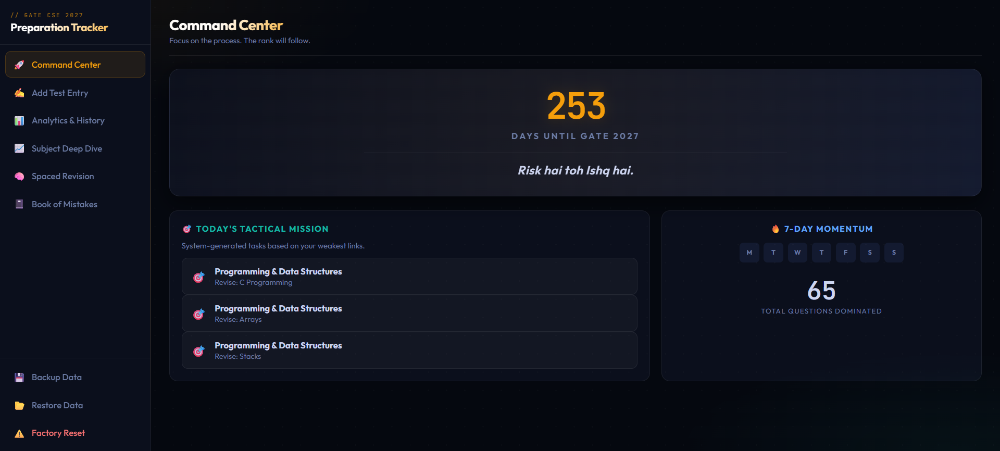
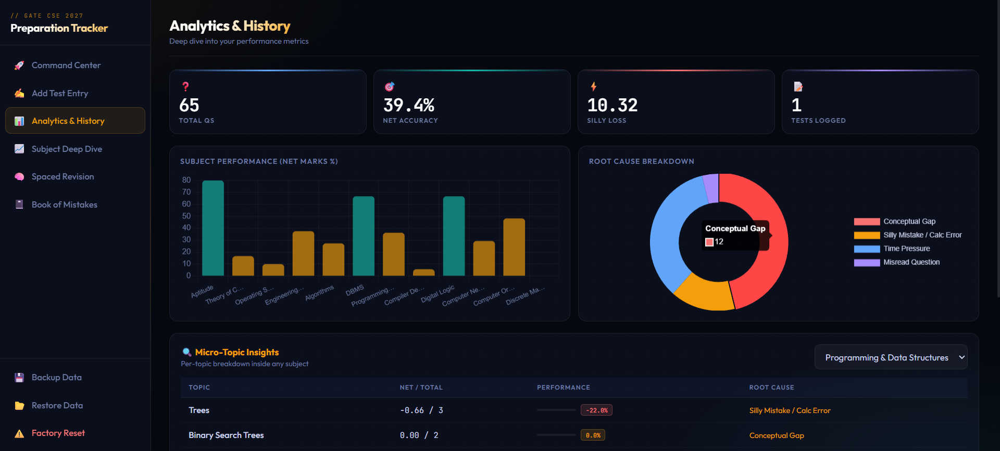
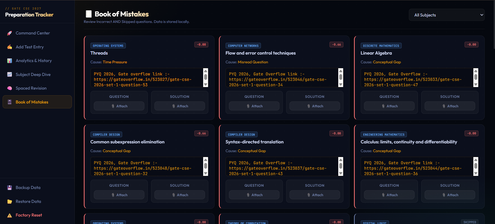

<div align="center">


[](#tech-stack)
[](#tech-stack)
[](#tech-stack)
[](#privacy-first)


</div>

## Overview

**GATE CSE 2027 Tracker** is a fully local, browser-based preparation dashboard for Computer Science aspirants. It turns mock-test entries into useful signals: topic accuracy, negative marking impact, weak-area detection, revision alerts, and a searchable Book of Mistakes.

No login. No backend. No spreadsheet chaos. Just open `index.html` and start tracking.

## App Preview

<table>
  <tr>
    <td width="55%">
      
    </td>
    <td width="45%">
      <h3>Command Center</h3>
      <p>Your daily cockpit for countdown, consistency, tactical missions, revision pressure, and performance momentum.</p>
      <ul>
        <li>GATE 2027 countdown</li>
        <li>7-day study streak</li>
        <li>Priority revision queue</li>
        <li>High-signal performance cards</li>
      </ul>
    </td>
  </tr>
  <tr>
    <td width="45%">
      <h3>Analytics & History</h3>
      <p>Every mock becomes a readable performance story, so you can see what improved, what slipped, and where marks were lost.</p>
      <ul>
        <li>Net score and accuracy tracking</li>
        <li>Subject-wise performance breakdown</li>
        <li>Attempt history</li>
        <li>Mistake-pattern visibility</li>
      </ul>
    </td>
    <td width="55%">
      
    </td>
  </tr>
  <tr>
    <td width="55%">
      
    </td>
    <td width="45%">
      <h3>Book of Mistakes</h3>
      <p>A local mistake journal built for real revision, with question and solution attachments stored inside your browser.</p>
      <ul>
        <li>Incorrect and skipped question logging</li>
        <li>Root-cause tagging</li>
        <li>Question and solution uploads</li>
        <li>Subject filtering</li>
      </ul>
    </td>
  </tr>
</table>

## Features

| Area | What it does |
| --- | --- |
| Command Center | Shows countdown, streak, momentum, daily tactical missions, and revision pressure. |
| Smart scoring | Applies GATE-style negative marking for MCQ questions and zero penalty for MSQ/NAT. |
| SRS revision | Schedules topics by difficulty so weak concepts return at the right time. |
| Micro-topic analytics | Tracks 80+ GATE CSE topics and highlights exact weak zones. |
| Mistake review | Stores mistakes, skipped questions, root causes, notes, and attachments. |
| Backup system | Exports and imports your complete tracker data as JSON. |

## Privacy First

Your preparation data stays on your machine.

- Test data and metrics are stored in browser `localStorage`.
- Attached files are stored in browser `IndexedDB`.
- There is no server, account system, or remote database.
- Backup and restore are handled through local JSON export/import.

## Tech Stack

| Layer | Tools |
| --- | --- |
| Frontend | HTML5, CSS3, Vanilla JavaScript |
| Charts | Chart.js via CDN |
| Text data | `localStorage` |
| File storage | `IndexedDB` |
| Runtime | Any modern browser |

## Run Locally

1. Clone the repository:

```bash
git clone https://github.com/Sriramsahoo2004/gate-cse-tracker.git
```

2. Open the project folder.

3. Double-click `index.html` or open it in Chrome, Edge, Brave, Firefox, or any modern browser.

That is it. No install step, no build command, no database setup.

## Project Structure

```text
.
+-- assets/
|   +-- Book_of_Mistakes.png
|   +-- Command.png
|   +-- History.png
+-- index.html
+-- README.md
```

## Adapt It

Want to customize this tracker for another GATE branch? Update the syllabus data inside `index.html`, especially the CSE topic list used by the analytics and revision system.

<div align="center">


</div>
